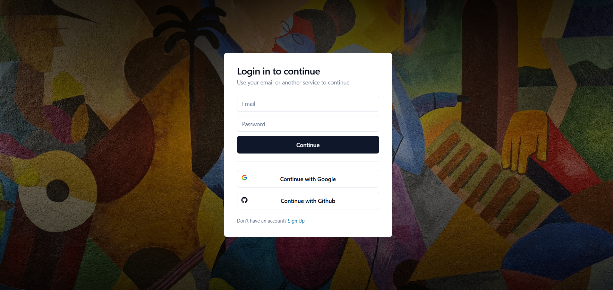
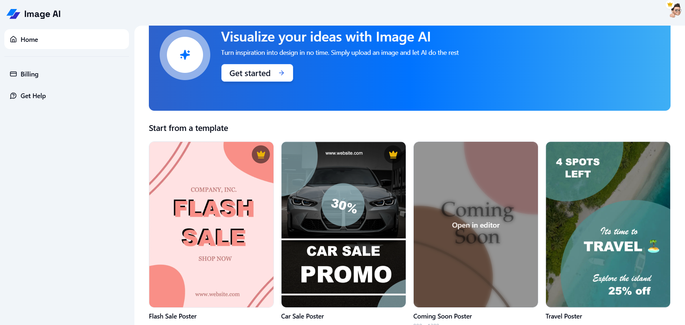
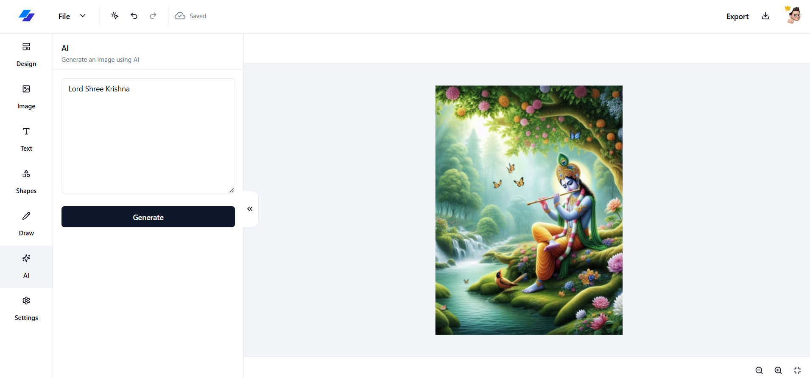
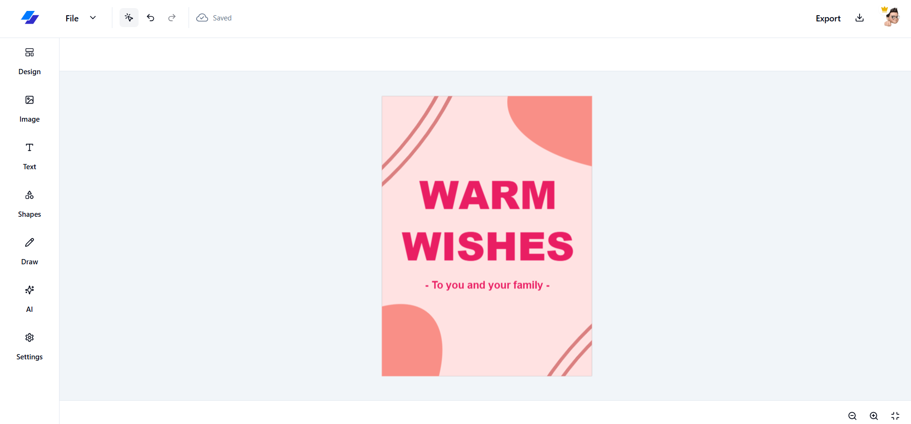
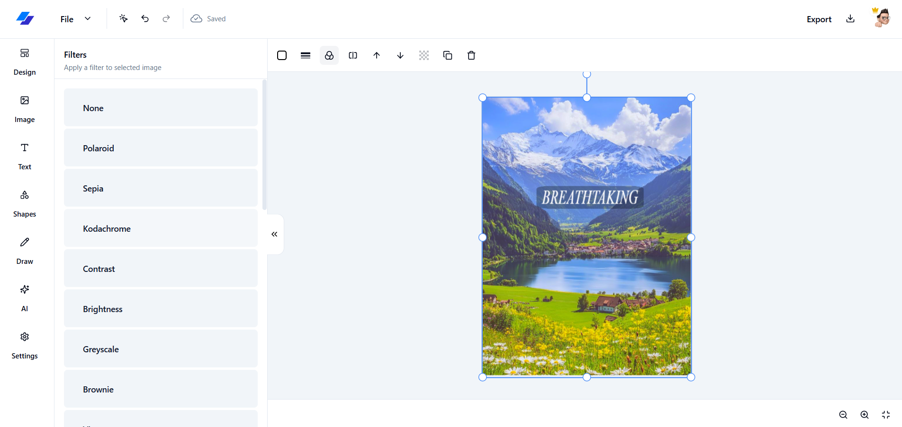

# 🚀 Image-AI: AI-Powered Graphic Design SaaS  

**Image-AI** is a full-stack **AI-powered graphic design platform** that combines **AI-driven tools, intuitive editing, and seamless subscriptions** to enhance creativity and workflow.  

---

## 🖼️ Demo Screenshots  

### **1️⃣ Login & Authentication**  
  

---

### **2️⃣ Dashboard & Editor**  
  

---

### **3️⃣ AI Image Generation**  
  

---

### **4️⃣ Predefined Templates**  
  

---

### **5️⃣ Image Filters & Adjustments**  
  

---

### **6️⃣ Receipt Generation (Stripe Integration)**  
  

---

## 🎨 Key Features  

### **🧠 AI-Powered Tools**  
✅ **AI Image Generation** – Create visuals from text using **Hugging Face Models**  
✅ **AI Background Removal** – Remove image backgrounds effortlessly  

---

### **🎨 Design & Editing**  
✅ **Drag & Drop Editor** – Intuitive design tools for easy customization  
✅ **Predefined Templates** – Jumpstart projects with professional layouts  
✅ **Advanced Text & Shape Tools** – Customize fonts, alignments, and styles  
✅ **Freehand Drawing** – Sketch and annotate directly in the editor  
✅ **Auto-Zoom & Filters** – Enhance designs with smart adjustments  

---

### **⚡ User Experience & Functionality**  
✅ **Personal Dashboard** – Manage designs efficiently  
✅ **Real-Time Autosave** – Never lose progress  
✅ **Keyboard Shortcuts** – Speed up workflow with intuitive commands  

---

### **🔗 Integrations & Security**  
✅ **Image Uploads (UploadThing)** – Easily manage and edit images  
✅ **Unsplash API** – Access a vast library of high-quality images  
✅ **Secure Authentication (Auth.js)** – Google, GitHub, and email login  
✅ **Subscription Management (Stripe)** – Handle payments securely  
✅ **Multi-Format Export** – Download designs as **PNG, JPG, SVG, PDF, JSON**  

---

## 🛠️ Tech Stack  

🚀 **Frontend:** Next.js, TailwindCSS, Shadcn UI  
🖥️ **Backend:** Hono.js, PostgreSQL (NeonDB), DrizzleORM  
🤖 **AI Integration:** Hugging Face, Replicate  
📦 **Storage & Authentication:** UploadThing, Unsplash, Auth.js  
💳 **Payments:** Stripe  

---
